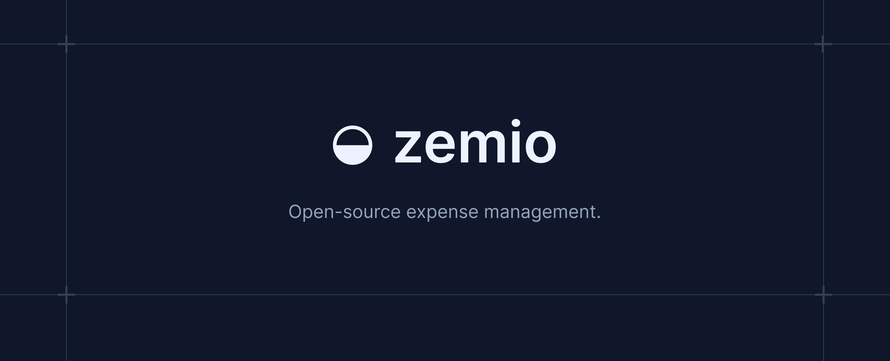

  

Zemio is an open-source, self-hostable expense management platform for student initiatives. It handles the full lifecycle of an expense report — from submission and receipt upload through review, approval, and reimbursement — across multiple organizations.

> [!IMPORTANT]
> Zemio is in public beta and under active development. Expect breaking changes.

## Features

- **Expense reports** — submit reports with itemized expenses, each backed by type-specific details (e.g. travel, food)
- **Receipt attachments** — upload supporting documents per expense (up to 5 files, 5 MB each)
- **Review workflow** — reports move through `Draft → Pending Approval → Needs Revision / Accepted / Rejected → Paid`, with reviewers able to request revisions or approve
- **Multi-tenant organizations** — each organization manages its own members, roles, and settings; users can belong to multiple organizations
- **Microsoft OAuth** — sign in with Microsoft; users are automatically mapped to their organization via tenant ID
- **Encrypted banking details** — reimbursement details are encrypted field-by-field and snapshotted immutably at submission time
- **Cost units** — allocate expenses against cost units and cost unit groups for budget tracking
- **PDF export** — generate a summary PDF of a report, including reimbursement details
- **Audit trail** — track changes across reports and expenses

## Tech stack

- [Next.js](https://nextjs.org/) (App Router) + React + TypeScript
- [tRPC](https://trpc.io/) for the API layer
- [Prisma](https://www.prisma.io/) ORM
- [Better Auth](https://www.better-auth.com/) with Microsoft OAuth
- [Tailwind CSS](https://tailwindcss.com/)
- [TanStack Query](https://tanstack.com/query), [TanStack Table](https://tanstack.com/table), [TanStack Form](https://tanstack.com/form)

## Self-hosting

Zemio is self-hostable. See [CONTRIBUTING.md](./CONTRIBUTING.md) for setup instructions to run it locally; a dedicated deployment guide is available at [docs/deployment.md](./docs/deployment.md).

## Contributing

Contributions are welcome. Please refer to [CONTRIBUTING.md](./CONTRIBUTING.md) for guidelines on getting the project running locally and submitting changes.

## License

This project is licensed under the MIT License — see [LICENSE.md](./LICENSE.md) for details.

## Support

- **Bugs or issues with the app:** please open a [GitHub issue](https://github.com/zemio-co/zemio/issues)
- **Everything else:** [support@zemio.co](mailto:support@zemio.co)
