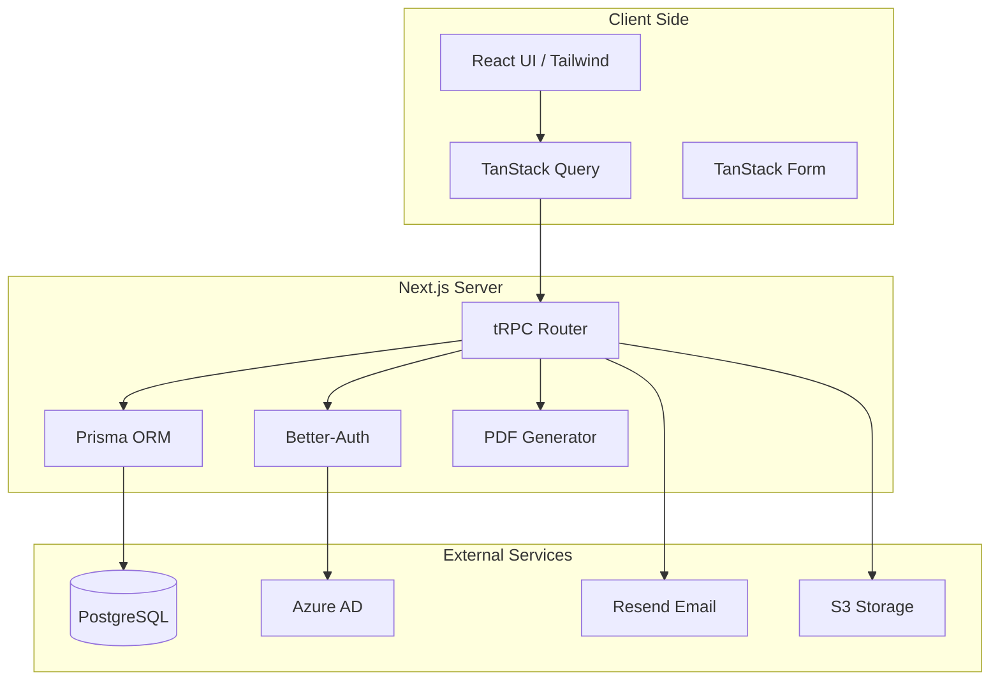

# System Architecture

The Spesen Tool is a full-stack Next.js application built with a focus on type safety and developer productivity.

## High-Level Overview

The following diagram illustrates the core components and their interactions:

## Frontend Architecture

### Next.js App Router
The application uses the Next.js App Router for server-side rendering, streaming, and efficient navigation. Pages are located in `src/app`.

### tRPC Client
All data fetching and mutations are performed via tRPC, providing end-to-end type safety. The client configuration is in `src/trpc`.

### Form Management
[TanStack Form](https://tanstack.com/form) is used for complex forms like expense report creation, ensuring validation and type safety across fields.

### Styling
[Tailwind CSS](https://tailwindcss.com/) is used for styling, with components based on a custom UI library built on [Base UI](https://base-ui.com/).

## Backend Architecture

### tRPC Server
The API layer is built with tRPC. Routers are organized by domain in `src/server/api/routers`. The root router is defined in `src/server/api/root.ts`.

### Authentication
[Better-Auth](https://www.better-auth.com/) handles authentication, specifically integrated with Microsoft Azure AD. Sessions are stored in the PostgreSQL database.

### Database (Prisma)
[Prisma](https://www.prisma.io/) serves as the ORM, providing a type-safe interface to the PostgreSQL database. The schema is defined in `prisma/schema.prisma`.

### External Services
- **Storage**: Receipts and attachments are stored in S3-compatible storage using `@better-upload`.
- **Email**: Notifications are sent via [Resend](https://resend.com/) using [React Email](https://react.email/) templates found in `src/components/emails`.

## Core Workflows

### Expense Report Lifecycle

1. **Draft**: User creates a report and adds expenses. Only visible to the owner.
2. **Pending Approval**: User submits the report. It becomes visible to admins/reviewers.
3. **Review**: Admins can approve, reject, or request revisions.
4. **Finalized**: Once accepted or rejected, the report status is updated, and the user is notified.

### Configuration System
The app uses a dual configuration system:
- `config.ts`: Non-sensitive settings (URLs, IDs).
- `.env`: Sensitive secrets (API keys, passwords).
Both are validated against a Zod schema in `src/lib/config/schema.ts`.
