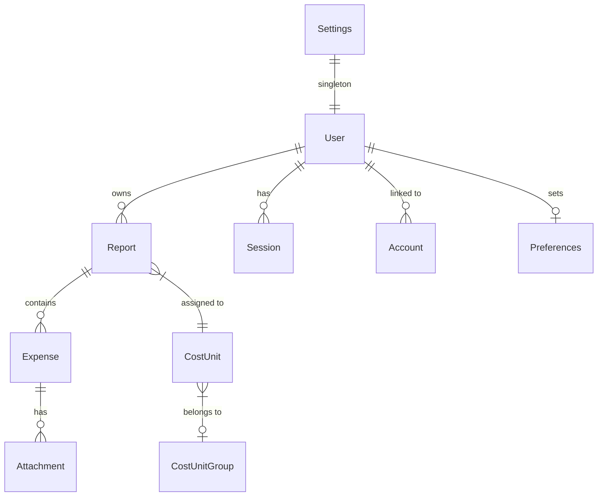

# Database Schema

The Spesen Tool uses PostgreSQL as its primary database. The schema is managed via Prisma.

## Entity-Relationship Diagram

## Core Models

### `Report`
Represents an expense report containing one or more expenses.
- `id`: Unique identifier (CUID).
- `title`: Short descriptive name.
- `status`: Lifecycle state (`DRAFT`, `PENDING_APPROVAL`, `NEEDS_REVISION`, `ACCEPTED`, `REJECTED`).
- `ownerId`: Relation to the `User` who created it.
- `costUnitId`: Relation to the `CostUnit` this report is billed against.

### `Expense`
Individual line items within a report.
- `type`: Category (`RECEIPT`, `TRAVEL`, `FOOD`).
- `amount`: Monetary value.
- `startDate` / `endDate`: Time range for the expense.
- `meta`: JSON field storing type-specific metadata (e.g., travel distance, meal deductions).

### `CostUnit` & `CostUnitGroup`
Used to categorize expenses for accounting purposes.
- `tag`: Unique short code (e.g., "PRJ-2024").
- `title`: Human-readable name.
- `examples`: List of common items for this cost unit.

### `User`
User profiles and roles.
- `role`: Access level (`user`, `admin`).
- `banned`: Flag for disabling access.

## Authentication Models (Better-Auth)
These models are required and managed by Better-Auth:
- `Session`: Active user sessions.
- `Account`: Linked OAuth accounts (Microsoft Azure AD).
- `Verification`: Tokens for email verification or other flows.

## Global Models

### `Settings`
A singleton model storing global configuration parameters:
- `kilometerRate`: Default rate for travel expenses.
- `dailyFoodAllowance`: Standard allowance for meals.
- `reviewerEmail`: Global contact for report reviews.

### `Preferences`
User-specific UI and notification settings.

## Enums

### `ReportStatus`
- `DRAFT`: Still being edited by the owner.
- `PENDING_APPROVAL`: Submitted and waiting for reviewer action.
- `NEEDS_REVISION`: Reviewer sent it back for changes.
- `ACCEPTED`: Approved for reimbursement.
- `REJECTED`: Declined by reviewer.

### `ExpenseType`
- `RECEIPT`: Physical or digital receipts for purchases.
- `TRAVEL`: Mileage or transport costs.
- `FOOD`: Daily allowance (Per Diem) for meals.
